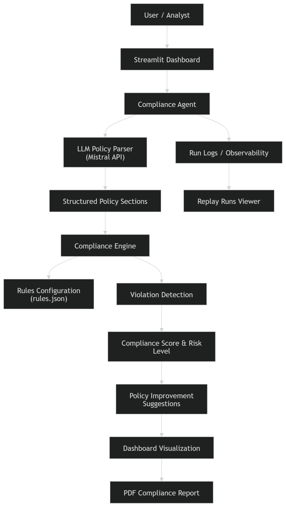
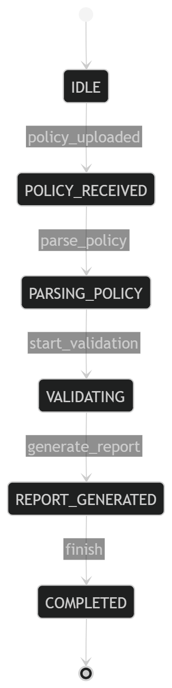

# 🛡️ Policy Compliance Intelligence

🔗 **Live Demo:**
[https://policy-compliance-checker-cx7k7ky9z3m3tsuazvtv9v.streamlit.app/](https://policy-compliance-checker-cx7k7ky9z3m3tsuazvtv9v.streamlit.app/)

An AI-powered **policy compliance analysis system** that evaluates organizational policies against a predefined compliance checklist.

The system combines **LLM-based policy extraction** with a **deterministic rule-based validation engine** to identify compliance violations and generate actionable improvement suggestions.

The application provides:

* Interactive **compliance analysis dashboard**
* **Benchmark evaluation** framework
* **Execution observability**
* **Replayable system runs**
* **Exportable PDF compliance reports**

---

# 📊 System Overview

The system analyzes policy documents and determines whether they satisfy key compliance requirements.

Pipeline:

1. Accept a policy as input
2. Extract structured compliance sections using an LLM
3. Validate extracted sections using a rule-based compliance engine
4. Detect violations and compute a compliance score
5. Generate improvement suggestions
6. Display results in an interactive dashboard
7. Export a professional compliance report

---

# 🌐 Live Application

You can try the system directly without installation:

👉 **Open the web app**

[https://policy-compliance-checker-cx7k7ky9z3m3tsuazvtv9v.streamlit.app/](https://policy-compliance-checker-cx7k7ky9z3m3tsuazvtv9v.streamlit.app/)

The deployed application allows users to analyze policies directly through a browser.

---

# 🏗️ System Architecture



Main components:

### Streamlit Dashboard

Interactive user interface for:

* Policy input
* Compliance score visualization
* Violation analysis
* Benchmark evaluation
* Run replay

---

### Compliance Agent

The **ComplianceAgent** orchestrates the system workflow.

Responsibilities:

* Manage state transitions
* Invoke the LLM policy parser
* Execute validation tools
* Generate improvement suggestions
* Log execution traces

---

### LLM Policy Parser

Uses **Mistral LLM API** to convert unstructured policy text into structured sections:

```
data_protection
access_control
retention
incident_reporting
```

Strict guardrails ensure:

* No hallucinated content
* Only verbatim extraction
* Missing sections returned as `null`

---

### Compliance Engine

A deterministic validation engine that:

* Loads rule definitions from `config/rules.json`
* Checks structured policy sections
* Calculates weighted compliance scores
* Determines policy risk level

---

### Rules Configuration

Compliance rules are defined in:

```
config/rules.json
```

Each rule includes:

* Rule ID
* Compliance field
* Severity level
* Rule weight
* Description

Example:

```json
{
 "id": "rule_data_protection",
 "field": "data_protection",
 "description": "Data protection section must be defined",
 "severity": "critical",
 "weight": 30
}
```

---

### Observability & Run Logs

Each analysis run produces:

* Unique **Run ID**
* Execution timestamp
* State machine transitions
* LLM extraction output
* Compliance results
* Generated suggestions

Runs are stored in:

```
runs/
```

---

### PDF Report Generator

The system generates a downloadable compliance report including:

* Compliance score
* Risk classification
* Violations detected
* Improvement suggestions
* Rule version metadata

---

# 🔄 State Machine



The system follows an explicit execution state machine.

```
IDLE
↓
POLICY_RECEIVED
↓
PARSING_POLICY
↓
VALIDATING
↓
REPORT_GENERATED
↓
COMPLETED
```

Each transition is logged and visible in the dashboard.

---

# 🚀 Features

## Policy Analysis

* LLM-based structured extraction
* Deterministic rule validation
* Weighted compliance scoring
* Risk classification
* Improvement suggestions

---

## Dashboard

Interactive analytics including:

* Compliance score gauge
* Violation severity distribution
* Execution metrics
* State transition history

---

## Benchmark Evaluation

Evaluation across **10 benchmark scenarios**:

* Fully compliant policy
* Missing retention policy
* Keyword-only policy
* Empty policy
* Partial compliance cases

Metrics include:

* Structured compliance score
* Baseline keyword score
* Violation counts
* Critical detection rate

---

## Observability

Each run logs:

* Run ID
* Execution timestamps
* State transitions
* LLM outputs

---

## Replay System

The **Replay Runs** tab allows users to:

* View previous executions
* Reconstruct results
* Inspect agent decisions

---

## Reporting

Export **PDF compliance reports** containing:

* Compliance score
* Risk level
* Detected violations
* Improvement recommendations

---

# 🧪 How to Use the Web Application

## 1️⃣ Analyze a Policy

Open the **Compliance Analysis** tab.

Steps:

1. Paste a policy into the text input field
2. Click **Analyze Policy**
3. The system will:

   * Extract structured policy sections
   * Validate compliance rules
   * Calculate compliance score
   * Detect violations
   * Generate improvement suggestions

---

## 2️⃣ View Compliance Results

The dashboard displays:

* Compliance score gauge
* Risk level classification
* Violation count
* Execution time
* Severity distribution chart

You can also inspect:

* LLM extracted sections
* State machine transitions

---

## 3️⃣ Download Compliance Report

After analysis:

Click

```
Download Compliance Report (PDF)
```

The generated report includes:

* Compliance score
* Violations detected
* Risk classification
* Improvement suggestions

---

## 4️⃣ Run Benchmark Evaluation

Open the **Benchmark Analytics** tab.

Click:

```
Run Benchmark Evaluation
```

The system will execute **10 evaluation scenarios** and display:

* Average structured compliance score
* Average baseline keyword score
* Baseline overestimation cases
* Critical detection rate
* Scenario comparison charts

---

## 5️⃣ Replay Previous Runs

Open the **Replay Runs** tab.

Steps:

1. Select a run ID
2. Click **Load Run**

This displays:

* Run metadata
* State transition history
* LLM output
* Validation results

---

# 🧪 Quick Test Policy

You can test the system with this example:

```
Data Protection:
All user data is encrypted using AES-256.

Access Control:
Role-based access control is enforced.

Retention:
Data is retained for 7 years.

Incident Reporting:
Incidents must be reported within 24 hours.
```

Paste this policy into the dashboard and click **Analyze Policy**.

---

# 🛠️ Tech Stack

### Backend

* Python

### AI Integration

* Mistral LLM API

### Frontend

* Streamlit

### Visualization

* Plotly
* Matplotlib

### Data Processing

* Pandas

### PDF Reporting

* ReportLab

### Schema Validation

* Pydantic

---

# 📂 Project Structure

```
policy-compliance-checker/
│
├── app.py
├── agent.py
├── state_machine.py
├── evaluation.py
├── report_generator.py
├── models.py
│
├── tools/
│   └── compliance_engine.py
│
├── config/
│   └── rules.json
│
├── runs/
│
├── architecture.png
├── state_machine.png
│
├── requirements.txt
└── README.md
```

---

# ⚙️ Local Installation

Clone the repository:

```
git clone <repository-url>
cd policy-compliance-checker
```

Create virtual environment:

```
python -m venv venv
```

Activate environment:

Windows:

```
venv\Scripts\activate
```

Install dependencies:

```
pip install -r requirements.txt
```

---

# 🔑 Environment Variables

Create a `.env` file:

```
MISTRAL_API_KEY=your_api_key
MISTRAL_MODEL=mistral-large-latest
MISTRAL_API_URL=https://api.mistral.ai/v1/chat/completions
```

---

# ▶️ Running Locally

Start the dashboard:

```
streamlit run app.py
```

---

# 🧪 Running Evaluation

Run benchmark evaluation from CLI:

```
python evaluation.py
```

---

# 🧩 Guardrails

The system includes multiple safety mechanisms:

* Tool allowlist enforcement
* Maximum execution steps
* API timeout handling
* Schema validation for LLM outputs
* Deterministic rule validation

These ensure reliable and safe agent execution.

---

# 🎯 Demo Workflow

Typical demo flow:

1. Enter a policy in the dashboard
2. Run compliance analysis
3. View violations and compliance score
4. Inspect state transitions
5. Review improvement suggestions
6. Download compliance report
7. Run benchmark analytics

---

# 📜 License

This project is intended for **educational and research purposes**.